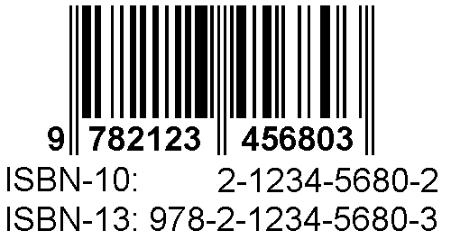

In the ISBN-10 (*International Standard Book Numbering*) system that was
used until the end of 2006, each book is assigned a unique 10-digit
code. The first nine digits uniquely identify the book itself, whereas
the last digit merely serves as a check digit to detect invalid ISBN-10
codes.

{height="140"}

If \$\$x\_1, \\ldots, x\_9\$\$ represent the first nine digits of an
ISBN-10 code, the check digit \$\$x\_{10}\$\$ is calculated as
\\\[x\_{10} = (x\_1 + 2x\_2 + 3x\_3 + 4x\_4 + 5x\_5 + 6x\_6 + 7x\_7 +
8x\_8 + 9x\_9)\\!\\!\\!\\!\\mod{11}\\\] As a result, \$\$x\_{10}\$\$
always takes a value in between 0 and 10. You are asked to write a
program that computes the tenth digit of an ISBN code, for which the
first nine digits are given.

### Input

Nine integers \$\$x\_1, \\ldots, x\_9\$\$ (\$\$0 \\leq x\_1, \\ldots,
x\_9 \\leq 9\$\$), each on a separate line. These integers represent the
first nine digits of a given ISBN-10 code.

### Output

A single line containing an integer: the ISBN-10 check digit
corresponding to the nine digits given. This check digit should be
printed without leading zeroes.

### Example

**Input:**

    9
    9
    7
    1
    5
    0
    2
    1
    0

**Output:**

    0

### Epilogue

{height="320px"}
